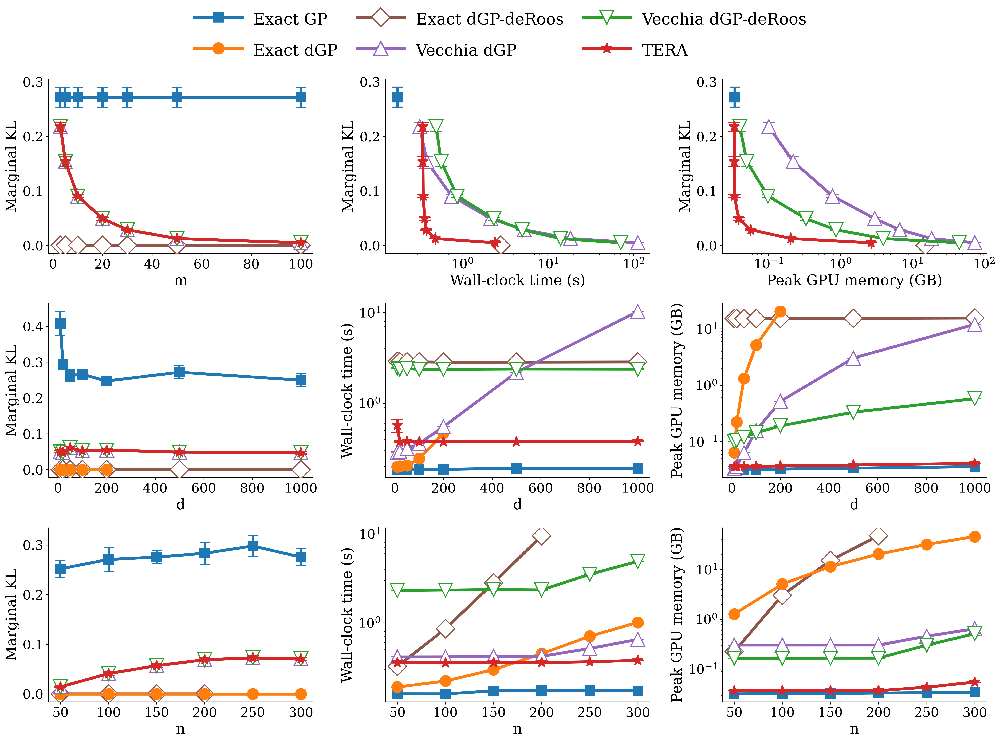
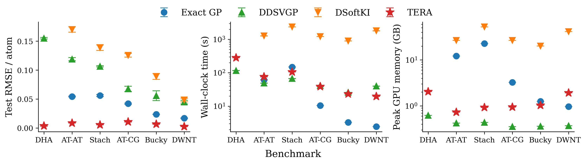
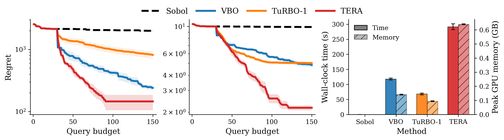

# TERA: Scalable Derivative Gaussian Processes via Exact Gradient Reduction

This repository provides the official implementation of **TERA**, a scalable derivative Gaussian process method for 
scalar function-value prediction with observed input gradients. For each target and its Vecchia conditioning set, 
TERA replaces the full gradient by target-specific reduced directional derivatives. For stationary kernels, this 
reduction preserves the corresponding full-gradient conditional density exactly, while avoiding the dense derivative 
covariance over all gradient coordinates.

The code reproduces the experiments for:

- GP-simulated posterior fidelity and computational scaling relative to exact derivative GP inference.
- Large-scale GP regression with observed gradients on the MD22 benchmark.
- High-dimensional Bayesian optimization on synthetic function benchmarks.

---

## Main Results

### Posterior Fidelity and Scaling



**Figure 1:** Posterior fidelity and computational scaling under GP simulations. Rows show sweeps over the conditioning 
size `m` at `(d, n) = (500, 150)`, input dimension `d` at `(m, n) = (20, 150)`, and training size `n` at `d = 150` with 
`m = max(20, n / 10)`. Columns report average marginal KL divergence to the exact derivative GP posterior, 
wall-clock time, and peak GPU memory.

### Large-Scale GP Regression



**Figure 2:** Large-scale scalar energy prediction on MD22. Panels show raw energy test RMSE per atom after conversion 
to physical units, end-to-end wall-clock time, and peak GPU memory. All methods use isotropic squared exponential kernels 
and identical train and test splits. Lower values are better in all panels.

### High-Dimensional Bayesian Optimization



**Figure 3:** High-dimensional BO under a fixed budget of 150 objective evaluations. The first two 
panels report simple regret on the full-dimensional `Levy-200D` and `Ackley-200D` benchmarks, respectively. 
The right panel reports wall-clock time and peak GPU memory on `Ackley-200D`.

---

## Installation

Use Python 3.10 or newer. A CUDA-enabled PyTorch installation is recommended for the main experiments.

```bash
python -m venv tera
source tera/bin/activate
pip install -e .
```
---

## Experiments

Each experiment has a paper-matching default config and a dedicated reproduction guide with the exact run and plotting commands.


| Experiment                        | Run script                            | Default config                           | Documentation |
|:----------------------------------|:--------------------------------------|:-----------------------------------------|:--|
| Posterior fidelity and scaling    | `scripts/run_gp_sim_kl_subprocess.py` | `configs/gp_sim_kl/matern52_*.yaml`      | `docs/gp_simulation.md` |
| Large-scale GP regression on MD22 | `scripts/run_md22_fair_pipeline.py`   | `configs/md22_regression/md22_main.yaml` | `docs/md22_regression.md` |
| High-dimensional BO               | `scripts/run_bo_synthetic.py`         | `configs/bo_synthetic/bo_main.yaml`      | `docs/bo_synthetic.md` |

---

## Citation

```bibtex
@misc{seung2026scalabledgp,
  title         = {Scalable Derivative Gaussian Processes via Exact Gradient Reduction},
  author        = {Seung, Hyunseok and Katzfuss, Matthias},
  eprint        = {2606.02909},
  archivePrefix = {arXiv},
  year          = {2026}
}
```
